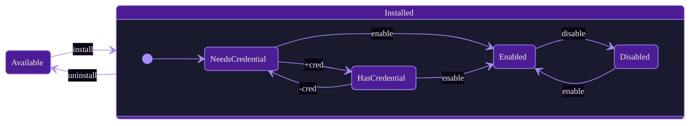

# agentOS Plugins

Open-source plugin definitions for [agentOS](https://github.com/jcontini/agentos).

Plugins teach AI agents how to use your apps and APIs — they're markdown files with configuration and documentation.

## What's a Plugin?

A plugin is a markdown file (`plugins/{id}/plugin.md`) with:
- **YAML frontmatter** — metadata, auth config, action definitions
- **Markdown body** — instructions the AI reads to use the plugin

```yaml
---
id: todoist
name: Todoist
description: Personal task management
tags: [tasks, productivity]
icon: https://cdn.simpleicons.org/todoist

auth:
  type: api_key
  header: Authorization
  prefix: "Bearer "

actions:
  get_tasks:
    readonly: true
    api:
      method: GET
      url: https://api.todoist.com/rest/v2/tasks
  
  create_task:
    api:
      method: POST
      url: https://api.todoist.com/rest/v2/tasks
---

# Todoist

Instructions for AI go here...
```

## Core Concepts

### Plugin Lifecycle



### Actions

Operations a plugin can perform:

| Field | Description |
|-------|-------------|
| `readonly: true` | Safe to call without confirmation |
| `readonly: false` | Requires `confirmAction: true` to execute |

Naming: `get_*`, `create_*`, `update_*`, `delete_*`, `search`

### Accounts

All plugins support multiple accounts (Personal, Work, etc.) at the AgentOS level.

## Using Plugins

1. Open agentOS → Plugins
2. Browse and install a plugin
3. Add credentials if required
4. AI agents can now use it via MCP

## Contributing

See **[CONTRIBUTING.md](CONTRIBUTING.md)** for the complete guide:
- Plugin schema and all fields
- Action types (REST, GraphQL, Shell)
- Authentication options
- AI-first design best practices
- Testing and validation

## License

MIT
