# AgentOS Community

This repository is the hub of the AgentOS community—open-source plugins, components, apps, and agent configs for [AgentOS](https://github.com/jcontini/agentOS-core).

---

## What is AgentOS?

**AgentOS is the semantic layer between AI assistants and your digital life.**

Your tasks are in Todoist. Your calendar is in Google. Your messages are split across iMessage, WhatsApp, Slack. Your files are everywhere. Each service is a walled garden—they don't talk to each other, and switching is painful.

**AgentOS fixes this.** It gives AI assistants a unified way to access all your services through a universal language. Your AI can manage tasks, read your calendar, send messages, and search the web—all through one interface, regardless of which service you use.

### The Vision

**You should own your digital life.** Not rent it. Not have it held hostage. Own it.

AgentOS creates a universal entity model—tasks, events, contacts, messages, files—that works across all services. A Todoist plugin maps Todoist's API to the universal `task` entity. A Linear plugin does the same. From your AI's perspective, they're identical: `task.list()`, `task.create()`, `task.complete()`.

This means:
- **Migration is trivial** — Switch from Todoist to Linear? Same entity, different backend
- **Cross-service queries work** — "Show tasks due today from all sources"
- **AI understands everything** — One schema, not 50 proprietary formats
- **You're in control** — Your data, your computer, your rules

### How It Works

```mermaid
%%{init: {'theme': 'dark', 'themeVariables': { 'fontSize': '16px', 'fontFamily': 'ui-monospace, monospace', 'lineColor': '#6b7280', 'primaryTextColor': '#f3f4f6' }}}%%
flowchart LR
    Entity(["📋 Entity<br/><small>task · event · contact · webpage</small>"])
    Plugin(["⚡ Plugin<br/><small>todoist · linear · exa · imessage</small>"])
    Cloud(["☁️ Cloud Services<br/><small>Todoist · Linear · Exa · Brave Search</small>"])
    Local(["💻 Your Computer<br/><small>Calendar · Contacts · iMessage · SQLite</small>"])
    App(["🖥️ App<br/><small>Browser · Tasks · Calendar</small>"])
    Component(["🧩 Component<br/><small>list · tabs · url-bar</small>"])
    Theme(["🎨 Theme<br/><small>Mac OS 9 · Windows 98</small>"])
    
    Entity -->|"implemented by"| Plugin
    Plugin -->|"connects to"| Cloud
    Plugin -->|"connects to"| Local
    Entity -->|"displayed by"| App
    App -->|"built with"| Component
    Theme -->|"styles"| App
    
    style Entity fill:#064e3b,stroke:#10b981,stroke-width:2px,color:#d1fae5
    style Plugin fill:#064e3b,stroke:#10b981,stroke-width:2px,color:#d1fae5
    style Cloud fill:#134e4a,stroke:#14b8a6,stroke-width:2px,color:#ccfbf1
    style Local fill:#134e4a,stroke:#14b8a6,stroke-width:2px,color:#ccfbf1
    style App fill:#4c1d95,stroke:#a78bfa,stroke-width:2px,color:#f3f4f6
    style Component fill:#374151,stroke:#9ca3af,stroke-width:2px,color:#f3f4f6
    style Theme fill:#374151,stroke:#9ca3af,stroke-width:2px,color:#f3f4f6
    
    linkStyle 0,1,2 stroke:#10b981,stroke-width:2px
    linkStyle 3,4,5 stroke:#a78bfa,stroke-width:2px
```



### What You Can Do

- **Let AI manage your tasks** — "Create a task to review the PR" → Done
- **Cross-service queries** — "What did I discuss with Sarah last week?" → Searches messages, emails, calendar
- **Unified calendar** — See events from Google Calendar, Apple Calendar, Outlook in one place
- **Smart workflows** — "Every morning, summarize unread emails and add tasks for action items"
- **Easy migration** — Switch from Todoist to Linear without losing data or relationships

### For Everyone

**You don't need to be technical to use AgentOS.** Enable plugins, connect your services, and your AI assistants can use them. The community builds the plugins—you just use them.

**You don't need to code to contribute.** Found a bug? Want a new plugin? Have an idea? Open an issue. The community is here to help.

---

## What's Here

This repository contains everything the AgentOS community builds:

```
entities/          Universal schemas (task, video, book, conversation, etc.)
plugins/           Service adapters (Linear → task, YouTube → video, etc.)
components/        Reusable UI building blocks
apps/              Entity renderers (Browser shows video/webpage, Tasks shows task)
agents/            Setup instructions for AI clients (Cursor, Claude, etc.)
```

### Entities

Universal schemas that define what things ARE, regardless of which service provides them.

```
entities/
  media/            # video, book, audio, image
  task.yaml         # Tasks from Todoist, Linear, etc.
  webpage.yaml      # Web content from any URL
  conversation.yaml # Chats from iMessage, WhatsApp, etc.
  ...
```

Entities live in folders for conceptual grouping (e.g., `media/` contains video, book, audio).

### Plugins

Service adapters that transform API responses into universal entities. Plugins also declare **URL handlers** — patterns that route URLs to the right plugin.

```
plugins/
  youtube/
    readme.md       # YAML config + markdown docs
    icon.png        # Square icon
    tests/          # Integration tests
  todoist/
  exa/
  ...
```

**URL Handlers:** When AI calls `url.read("youtube.com/...")`, the YouTube plugin handles it and returns a `video` entity. This happens automatically via URL pattern matching.

| Category | Plugins | Entity |
|----------|---------|--------|
| Tasks | todoist, linear | task |
| Messages | imessage, whatsapp | message, conversation |
| Databases | postgres, sqlite, mysql | (custom) |
| Calendar | apple-calendar | event |
| Contacts | apple-contacts | contact |
| Web | exa, firecrawl | webpage |
| Media | youtube, goodreads, hardcover | video, book |

### Components

Reusable UI pieces that compose atoms (text, image, icon, container).

```
components/
  url-bar/          # Location bar for browser views
  search-result/    # Search result card
  ...
```

### Apps

Render entities with components. Each app defines views for the entity types it can display.

```
apps/
  browser/          # Renders webpage, video, book, document
  settings/         # System configuration
  ...
```

**Entity routing is implicit.** The system scans app views to determine which app handles which entity. If multiple apps can render an entity, the user picks the default in Settings.

### Agents

Setup instructions for AI clients that use AgentOS via MCP.

```
agents/
  cursor/           # Cursor IDE setup
  claude/           # Claude Desktop setup
  raycast/           # Raycast setup
  ...
```

---

## Contributing

**Anyone can contribute.** You don't need to code. Found a bug? Want a new plugin? Have an idea? [Open an issue](https://github.com/jcontini/agentos-community/issues) or see [CONTRIBUTING.md](CONTRIBUTING.md) for how to build plugins.

**The community builds everything.** Plugins, components, apps, themes—all open source, all MIT licensed, all yours forever.

---

## License

**MIT** — see [LICENSE](LICENSE)

By contributing, you grant AgentOS the right to use your contributions in official releases, including commercial offerings. Your code stays open forever. See [CONTRIBUTING.md](CONTRIBUTING.md) for full terms.

---

## For Developers

### Development Setup

```bash
git clone https://github.com/jcontini/agentos-community
cd agentos-community
npm install    # Sets up pre-commit hooks
```

### Testing

**Validation** (schema + test coverage):
```bash
npm run validate              # Check all plugins
```

**Functional tests** (actual API calls):
```bash
npm test                      # Run all tests (excludes .needs-work)
npm run test:needs-work       # Test plugins in .needs-work
npm test plugins/exa/tests    # Test specific plugin
```

**Test structure:** Tests are organized by domain (`tests/plugins/`, `tests/entities/`). See [CONTRIBUTING.md](CONTRIBUTING.md#testing) for details.

**The `.needs-work` folder:** Plugins that fail validation are automatically moved to `plugins/.needs-work/` to keep the main directory clean.

See **[CONTRIBUTING.md](CONTRIBUTING.md)** for plugin development, testing, and contribution terms.
