# Vibe Coach

A thinking framework for domain-driven design. Helps you discover entities, build shared vocabulary, and visualize relationships with beautiful diagrams.

Humans are visual creatures. We scan, we don't read. Structure communicates faster than prose.

---

## When to Use

Use Vibe Coach when:
- Starting a new project and need to clarify the domain
- Refactoring existing code to align with business language
- Onboarding to a codebase and need to understand the model
- Communicating architecture to stakeholders
- Feeling lost in complexity and need to "see" the system

---

## The Process

### 1. Discovery: What Are We Building?

Start with open questions:
- What problem does this solve?
- Who uses it? What do they call things?
- What are the key *nouns* in the domain?
- What *verbs* connect them?

**Goal:** Extract the natural language of the domain.

### 2. Glossary: Ubiquitous Language

Build a table of entities. One row per concept:

<table class="t">
<tr class="neutral-h"><th>Entity</th><th>Definition</th><th>Example</th><th>Notes</th></tr>
<tr><td class="neutral"><b>Recipe</b></td><td class="neutral">A set of instructions to make a dish</td><td class="neutral"><code>Spaghetti Carbonara</code></td><td class="neutral">Has ingredients, steps</td></tr>
<tr><td class="neutral"><b>Chef</b></td><td class="neutral">A person who creates recipes</td><td class="neutral"><code>Gordon Ramsay</code></td><td class="neutral">Can have multiple recipes</td></tr>
<tr><td class="neutral"><b>Ingredient</b></td><td class="neutral">A component used in recipes</td><td class="neutral"><code>Eggs, Pasta</code></td><td class="neutral">Has quantity, unit</td></tr>
</table>

<br>

**Rules:**
- Use the domain's language, not technical jargon
- One definition per term (no synonyms in code)
- If the business calls it X, the code calls it X

### 3. Map: Entity Relationships

Visualize with Mermaid diagrams. Use stadium shapes `(["text"])` and plain English verbs:

```mermaid
%%{init: {'theme': 'dark', 'themeVariables': { 'fontSize': '16px', 'fontFamily': 'ui-monospace, monospace', 'lineColor': '#6b7280', 'primaryTextColor': '#f3f4f6', 'edgeLabelBackground': '#1a1a2e' }}}%%
flowchart LR
    subgraph Container[" "]
        direction LR
        Cuisines(["🌍 Cuisines"]) -->|have| Recipes(["🍳 Recipes"])
        Chefs(["👨‍🍳 Chefs"]) -->|create| Recipes
        Recipes -->|require| Ingredients(["🥕 Ingredients"])
        Recipes -->|use| Equipment(["🔪 Equipment"])
        Recipes -->|have| Steps(["📝 Steps"])
        Steps -->|get| Reviews(["⭐ Reviews"])
    end
    
    style Container fill:#1a1a2e,stroke:#4a4a6a,stroke-width:2px,rx:10,ry:10
    style Cuisines fill:#134e4a,stroke:#14b8a6,stroke-width:2px,color:#ccfbf1
    style Recipes fill:#4c1d95,stroke:#a78bfa,stroke-width:2px,color:#f3f4f6
    style Chefs fill:#064e3b,stroke:#10b981,stroke-width:2px,color:#d1fae5
    style Ingredients fill:#1e3a5f,stroke:#3b82f6,stroke-width:2px,color:#dbeafe
    style Equipment fill:#78350f,stroke:#f59e0b,stroke-width:2px,color:#fef3c7
    style Steps fill:#374151,stroke:#9ca3af,stroke-width:2px,color:#f3f4f6
    style Reviews fill:#7c2d12,stroke:#f97316,stroke-width:2px,color:#ffedd5
    
    linkStyle 0 stroke:#14b8a6,stroke-width:2px
    linkStyle 1 stroke:#10b981,stroke-width:2px
    linkStyle 2 stroke:#a78bfa,stroke-width:2px
    linkStyle 3 stroke:#a78bfa,stroke-width:2px
    linkStyle 4 stroke:#a78bfa,stroke-width:2px
    linkStyle 5 stroke:#9ca3af,stroke-width:2px
```



Stadium shapes. Plain English verbs. Link colors match source node. **One color per entity, used consistently.**

### 4. Boundaries: Where Does Language Change?

Look for places where the same word means different things:
- "Account" in billing vs "Account" in authentication
- "Order" in e-commerce vs "Order" in sorting

These are **bounded contexts**. They may need separate models.

### 5. Decisions: Document the Why

Create a decisions log:

<table class="t">
<tr class="neutral-h"><th>Decision</th><th>Rationale</th><th>Date</th></tr>
<tr><td class="neutral"><b>Renamed Client → Agent</b></td><td class="neutral">Aligns with AI assistant terminology</td><td class="neutral">2024-12</td></tr>
<tr><td class="neutral"><b>Recipe owns Steps</b></td><td class="neutral">Steps don't exist without a recipe</td><td class="neutral">2024-12</td></tr>
</table>

---

## Visual Language

### The Palette Principle

**One color per entity. Use consistently across all diagrams, tables, and documentation.**

Don't specify what "blue means" upfront. Instead:
1. As you discover entities, assign each a unique color
2. Use that color everywhere: diagram nodes, table headers, underlines
3. Consistency creates visual vocabulary readers learn automatically

**Dark mode first:** Dark fills, bright strokes, light text.

### Entity Documentation Format

Document each entity with:
- Emoji + Name as heading
- Relationships indented below with colored underlines
- Styled table with colored header matching the entity

**Example:**

<a id="recipes"></a>

## 🍳 Recipes

<div style="margin-left:3em; margin-top:-1.5em; font-size:.9em; line-height:1.2em">
↳ Belong to <span style="text-decoration:underline; text-decoration-color:#14b8a6; text-decoration-thickness:2px; text-underline-offset:2px;">Cuisines</span><br>
↳ Created by <span style="text-decoration:underline; text-decoration-color:#10b981; text-decoration-thickness:2px; text-underline-offset:2px;">Chefs</span>
</div>

<table style="border-collapse:separate; border-spacing:0; font-size:90%;">
<tr style="background:#4c1d95; color:#f3f4f6;">
  <th style="border:1px solid #a78bfa; border-right:none; padding:5px; border-top-left-radius:8px;">Field</th>
  <th style="border:1px solid #a78bfa; border-right:none; padding:5px;">Example</th>
  <th style="border:1px solid #a78bfa; border-right:none; padding:5px;">Description</th>
  <th style="border:1px solid #a78bfa; padding:5px; border-top-right-radius:8px;">Type</th>
</tr>
<tr>
  <td style="border:1px solid #a78bfa; border-top:none; border-right:none; padding:5px;"><b>id</b></td>
  <td style="border:1px solid #a78bfa; border-top:none; border-right:none; padding:5px;"><code>spaghetti-001</code></td>
  <td style="border:1px solid #a78bfa; border-top:none; border-right:none; padding:5px;">Unique identifier</td>
  <td style="border:1px solid #a78bfa; border-top:none; padding:5px;"><code>string</code></td>
</tr>
<tr>
  <td style="border:1px solid #a78bfa; border-top:none; border-right:none; padding:5px;"><b>name</b></td>
  <td style="border:1px solid #a78bfa; border-top:none; border-right:none; padding:5px;"><code>Spaghetti Carbonara</code></td>
  <td style="border:1px solid #a78bfa; border-top:none; border-right:none; padding:5px;">Display name</td>
  <td style="border:1px solid #a78bfa; border-top:none; padding:5px;"><code>string</code></td>
</tr>
<tr>
  <td style="border:1px solid #a78bfa; border-top:none; border-right:none; padding:5px; border-bottom-left-radius:8px;"><b>difficulty</b></td>
  <td style="border:1px solid #a78bfa; border-top:none; border-right:none; padding:5px;"><code>medium</code></td>
  <td style="border:1px solid #a78bfa; border-top:none; border-right:none; padding:5px;"><code>easy</code>, <code>medium</code>, <code>hard</code></td>
  <td style="border:1px solid #a78bfa; border-top:none; padding:5px; border-bottom-right-radius:8px;"><code>enum</code></td>
</tr>
</table>

<br>

### State Diagrams

Show entity lifecycles:


### Architecture Diagrams

Show planned features with dashed lines. Built features stay solid.

```mermaid
%%{init: {'theme': 'dark', 'themeVariables': { 'fontSize': '14px', 'fontFamily': 'ui-monospace, monospace', 'lineColor': '#6b7280', 'primaryTextColor': '#f3f4f6', 'edgeLabelBackground': '#1a1a2e' }}}%%
flowchart LR
    subgraph Container[" "]
        Built(["✅ Built Feature"])
        Planned(["📋 Planned Feature"])
        Built -->|solid| Planned
    end
    
    style Container fill:#1a1a2e,stroke:#4a4a6a,stroke-width:2px,rx:10,ry:10
    style Built fill:#4c1d95,stroke:#a78bfa,stroke-width:2px,color:#f3f4f6
    style Planned fill:#4c1d95,stroke:#a78bfa,stroke-width:2px,stroke-dasharray:5 5,color:#f3f4f6
    
    linkStyle 0 stroke:#a78bfa,stroke-width:2px
```



<div style="font-size: 0.85em; color: #9ca3af; margin-top: -0.5em;">
<span style="border: 2px dashed #6b7280; padding: 2px 8px; border-radius: 4px;">Dashed</span> = Planned
</div>

---

## Principles

### General

<table class="t">
<tr class="neutral-h"><th>Principle</th><th>Why</th></tr>
<tr><td class="neutral"><b>Show, don't tell</b></td><td class="neutral">Examples before explanations — readers scan, they don't read</td></tr>
<tr><td class="neutral"><b>Dark mode first</b></td><td class="neutral">Dark fills, bright strokes, light text — easier on eyes</td></tr>
<tr><td class="neutral"><b>Plural entity names</b></td><td class="neutral">Recipes not Recipe — matches collections/tables</td></tr>
<tr><td class="neutral"><b>Native ## headings</b></td><td class="neutral">TOC support, anchor links, accessibility</td></tr>
<tr><td class="neutral"><b>One color per entity</b></td><td class="neutral">Consistency creates visual vocabulary</td></tr>
</table>

<br>

### Tables

<table class="t">
<tr class="neutral-h"><th>Principle</th><th>Why</th></tr>
<tr><td class="neutral"><b>Field | Example | Description | Type</b></td><td class="neutral">Concrete before abstract — show the value first</td></tr>
<tr><td class="neutral"><b>Entity colors for entity tables</b></td><td class="neutral">Header background matches the entity's assigned color</td></tr>
<tr><td class="neutral"><b>Neutral gray for everything else</b></td><td class="neutral">Generic tables use gray (#374151)</td></tr>
<tr><td class="neutral"><b>↳ for relationships</b></td><td class="neutral">Visual hierarchy under entity headings</td></tr>
<tr><td class="neutral"><b>Colored underlines</b></td><td class="neutral">Links to related entities use their color</td></tr>
</table>

<br>

### Diagrams

<table class="t">
<tr class="neutral-h"><th>Principle</th><th>Why</th></tr>
<tr><td class="neutral"><b>Stadium shapes</b></td><td class="neutral"><code>(["Label"])</code> — softer than sharp rectangles</td></tr>
<tr><td class="neutral"><b>Emoji prefix</b></td><td class="neutral">Visual scanning — see the type at a glance</td></tr>
<tr><td class="neutral"><b>Plain English verbs</b></td><td class="neutral">"have", "create", "use" — not "1:N" notation</td></tr>
<tr><td class="neutral"><b>Link colors match source</b></td><td class="neutral">Visual continuity — trace the flow</td></tr>
<tr><td class="neutral"><b>Dashed for planned</b></td><td class="neutral"><code>stroke-dasharray:5 5</code> — distinguish built vs future</td></tr>
<tr><td class="neutral"><b>LR for wide, TB for narrow</b></td><td class="neutral">Vertical flows better on narrow screens</td></tr>
</table>

---

## Avoid

- `erDiagram` — use `flowchart LR` or `flowchart TB`
- Sharp rectangles — use stadium shapes `(["..."])`
- ALL CAPS
- `1:N` notation — plain English verbs
- Singular entity names — use plurals
- Light theme
- Plain markdown tables — use styled `<table>`
- Type before Example — show concrete values first
- Prose descriptions — use tables
- Feature checklists — code is the source of truth

---

## Mermaid Reference

**Dark mode init block (use at start of every diagram):**
```
%%{init: {'theme': 'dark', 'themeVariables': { 'fontSize': '14px', 'fontFamily': 'ui-monospace, monospace', 'lineColor': '#6b7280', 'primaryTextColor': '#f3f4f6', 'edgeLabelBackground': '#1a1a2e' }}}%%
```

**Stadium shape:** `NodeName(["📦 Label"])`

**Subgraph with label:** `subgraph Id["Label"]`

**Node styling:**
```
style NodeName fill:#DARK,stroke:#BRIGHT,stroke-width:2px,color:#LIGHT
```

**Dashed (planned):**
```
style NodeName stroke-dasharray:5 5
linkStyle N stroke-dasharray:5 5
```

**Link color matches source:**
```
linkStyle 0 stroke:#BRIGHT,stroke-width:2px
```

---

## Output: The Domain Document

A complete domain document includes:
1. **Overview** - One paragraph describing the system
2. **Glossary** - Table of entities with definitions
3. **Diagram** - Visual map of relationships
4. **Entity Details** - Per-entity tables with fields
5. **Boundaries** - Where contexts separate
6. **Decisions** - Key choices and rationale

Use the `render` action to save as a markdown file.

---

## Tips

- **Start messy** - Brainstorm entities freely, refine later
- **Listen for nouns** - Business people name the entities
- **Listen for verbs** - These become relationships
- **Challenge synonyms** - "User", "Customer", "Member" → pick ONE
- **Iterate** - The model evolves as understanding deepens
- **Diagrams confirm** - If you can't draw it, you don't understand it
- **Colors are learned** - Readers will associate colors after seeing them twice

---

## Example Session

**User:** "I'm building a podcast app"

**Vibe Coach response:**

Let's discover your domain. Some questions:
1. What can users DO in your app? (listen, subscribe, download?)
2. What are the main THINGS? (podcasts, episodes, playlists?)
3. Do users have accounts? What do they own?

*[After discussion, build glossary and diagram together]*

Here's what I'm hearing:

<table class="t">
<tr class="neutral-h"><th>Entity</th><th>Definition</th></tr>
<tr><td class="neutral"><b>Podcasts</b></td><td class="neutral">A show with multiple episodes</td></tr>
<tr><td class="neutral"><b>Episodes</b></td><td class="neutral">A single audio file within a podcast</td></tr>
<tr><td class="neutral"><b>Subscriptions</b></td><td class="neutral">A user following a podcast</td></tr>
<tr><td class="neutral"><b>Queue</b></td><td class="neutral">User's list of episodes to play</td></tr>
</table>

<br>



```mermaid
%%{init: {'theme': 'dark', 'themeVariables': { 'fontSize': '14px', 'fontFamily': 'ui-monospace, monospace', 'lineColor': '#6b7280', 'primaryTextColor': '#f3f4f6' }}}%%
flowchart LR
    subgraph Container[" "]
        Users(["👤 Users"]) -->|subscribe to| Podcasts(["🎙️ Podcasts"])
        Podcasts -->|have| Episodes(["🎧 Episodes"])
        Users -->|add to| Queue(["📋 Queue"])
        Queue -->|contains| Episodes
    end
    
    style Container fill:#1a1a2e,stroke:#4a4a6a,stroke-width:2px,rx:10,ry:10
    style Users fill:#064e3b,stroke:#10b981,stroke-width:2px,color:#d1fae5
    style Podcasts fill:#4c1d95,stroke:#a78bfa,stroke-width:2px,color:#f3f4f6
    style Episodes fill:#1e3a5f,stroke:#3b82f6,stroke-width:2px,color:#dbeafe
    style Queue fill:#78350f,stroke:#f59e0b,stroke-width:2px,color:#fef3c7
    
    linkStyle 0 stroke:#10b981,stroke-width:2px
    linkStyle 1 stroke:#a78bfa,stroke-width:2px
    linkStyle 2 stroke:#10b981,stroke-width:2px
    linkStyle 3 stroke:#f59e0b,stroke-width:2px
```

Does this match your mental model? What's missing?

<!-- Styles for tables (works in Cursor/VS Code markdown preview) -->
<style>
.t { border-collapse: separate; border-spacing: 0; font-size: 90%; }
.t th, .t td { padding: 5px; }
.neutral-h { background: #374151; color: #f3f4f6; }
.neutral-h th { border: 1px solid #6b7280; border-right: none; padding: 5px; }
.neutral-h th:last-child { border-right: 1px solid #6b7280; }
td.neutral { border: 1px solid #6b7280; border-top: none; border-right: none; padding: 5px; }
td.neutral:last-child { border-right: 1px solid #6b7280; }
.neutral-h th:first-child { border-top-left-radius: 8px; }
.neutral-h th:last-child { border-top-right-radius: 8px; }
.t tr:last-child td.neutral:first-child { border-bottom-left-radius: 8px; }
.t tr:last-child td.neutral:last-child { border-bottom-right-radius: 8px; }
</style>
